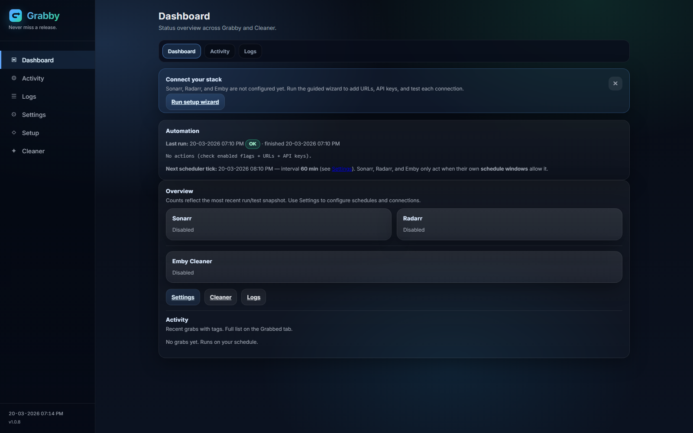
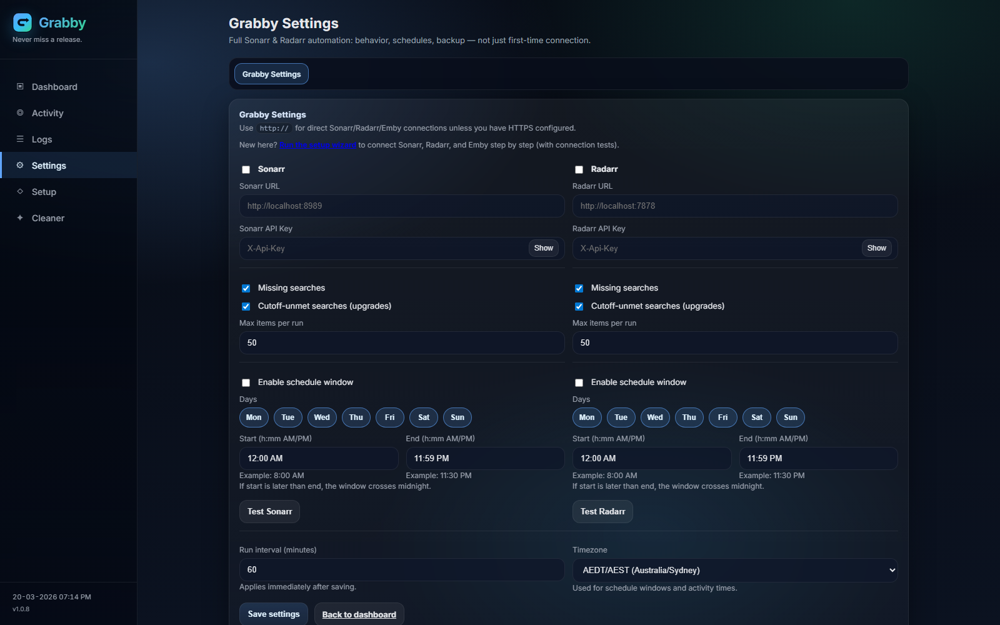
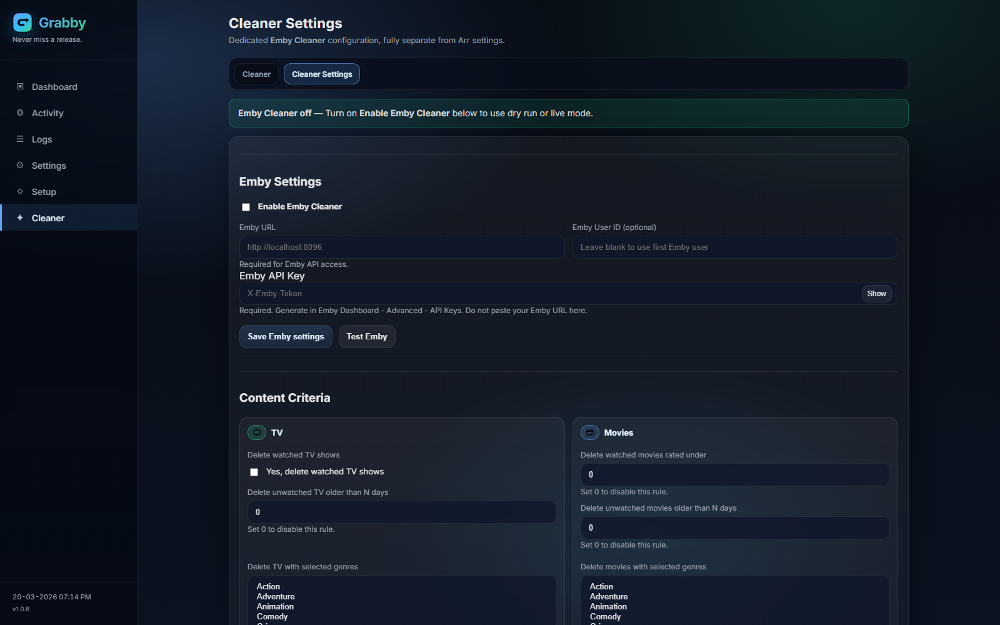
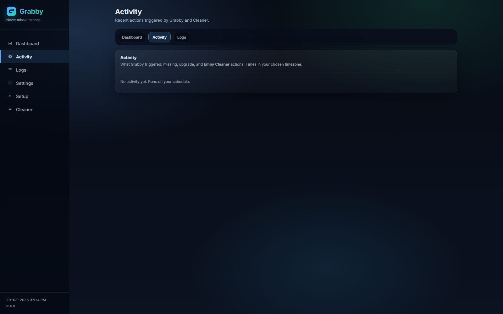

# Grabby

**Never miss a release (and clean up old media).** — Windows Service + Web UI that integrates with **Sonarr**, **Radarr**, and **Emby** to:

- Search for **missing** movies/episodes
- Re-trigger searches to **upgrade** existing items until the Arr app reports the **quality cutoff** is met (your Quality Profiles still decide what “better” means)
- Optionally run **Emby Cleaner rules** (dry-run supported) to delete old/low-rated content. The **Cleaner** tab opens right away; use **Scan Emby for matches** when you want to pull your library and see what fits your rules (big libraries can take a bit).

## Screenshots

### Dashboard



### Settings



### Cleaner Settings



### Activity



## Download (Windows installer)

**[Download GrabbySetup.exe (latest GitHub Release)](https://github.com/jampat000/Grabby/releases/latest/download/GrabbySetup.exe)**

- Requires **64-bit Windows**.
- The installer deploys **Grabby** as a **Windows Service** (WinSW) and opens the Web UI when setup finishes.

## Install & first run

1. Run **`GrabbySetup.exe`** and complete the wizard (admin prompt is normal for a service).
2. Open **`http://127.0.0.1:8765`** in your browser (default service port).
3. Use **Setup** in the sidebar (or **Settings** → *Run the setup wizard*) to add **Sonarr**, **Radarr**, and **Emby** with a **Test** on each step—or configure everything in **Settings** if you prefer. **Cleaner** rules and scans are under **Cleaner** / **Cleaner Settings** in the sidebar.

Upgrading an existing install: **Settings → Software updates** can run the latest **`GrabbySetup.exe`** silently (Windows service install), or follow **[`service/UPGRADE.md`](service/UPGRADE.md)** for manual steps.

Version is shown in the sidebar of the Web UI (`v…` next to the clock). It matches the repo **`VERSION`** file or your **release tag** when built in CI.

### Monitoring / observability

- **`GET /healthz`** — JSON: `status`, `app`, **`version`** (use for load balancers / uptime checks).
- **`GET /api/version`** — JSON: `app`, **`version`** (lightweight automation).
- Logs go to the **process console**; when running under **WinSW**, see the service wrapper logs in `service/README.md`. For long-running hosts, configure **log rotation** at the OS or service-manager level if log files grow large.

## Security

See **[`SECURITY.md`](SECURITY.md)** (reporting issues, handling API keys, official downloads).

GitHub Actions runs **pip-audit** on dependencies for the default branch. **Protect `master`** in repo settings — see **[`.github/BRANCH_PROTECTION.md`](.github/BRANCH_PROTECTION.md)**.

## What’s in this repo

- `app/`: FastAPI web app + background scheduler
- `service/`: WinSW (Windows Service Wrapper) config for running the packaged app as a Windows service
- `installer/`: Inno Setup script to produce `GrabbySetup.exe`
- `VERSION`: current release version (semver) for the app + installer metadata
- `docs/`: maintainer guides — **[public repo checklist](docs/PUBLIC-REPO-CHECKLIST.md)**, **[audit log after local checks](docs/PUBLIC-REPO-AUDIT.md)**

## License

This project is licensed under the **MIT License** — see [`LICENSE`](LICENSE).

## Contributing

**Pull requests** into **`master`** (branch protection + CI). See **[`CONTRIBUTING.md`](CONTRIBUTING.md)**.

## Backup & Restore

Export **Grabby** and **Cleaner** settings to **one JSON file** from **Settings** → **Backup & Restore** (move PCs, reinstall, keep API keys). Details: **[`HOWTO-RESTORE.md`](HOWTO-RESTORE.md)**.

## Changelog

See [`CHANGELOG.md`](CHANGELOG.md), including maintainer **Releasing** steps.

## Prereqs (dev)

- Python (via the `py` launcher)
- **E2E tests** (`tests/e2e/`): install dev deps, then **once** download Chromium:  
  `pip install -r requirements-dev.txt` → `py -m playwright install chromium`  
  (GitHub Actions uses `playwright install --with-deps chromium` on Ubuntu.)

## Run locally (dev)

```powershell
cd C:\Users\User\grabby
py -m venv .venv
.\.venv\Scripts\pip install -r requirements.txt
.\scripts\dev-start.ps1
```

Then open the URL printed by the script (default `http://127.0.0.1:8766`).

### Port **8765** vs **8766** (Simple Browser)

| URL | What it is |
|-----|------------|
| **`http://127.0.0.1:8765`** | The **installed** Grabby (**Windows service**). This is the packaged **`Grabby.exe`** from your last **`GrabbySetup.exe`**. It does **not** pick up edits you make in the git repo. |
| **`http://127.0.0.1:8766`** (or whatever `dev-start.ps1` prints) | **Development** server running **source code** from this folder (`uvicorn`). Use this to see UI/code changes immediately. |

**If you only ever open 8765:** rebuild with **`packaging\build.ps1`**, run a new **`GrabbySetup.exe`**, or use **Settings → Software updates** to get a release that includes the feature.

**To use port 8765 for dev** (same URL you’re used to): stop the **Grabby** service in `services.msc`, then from the repo run  
`.\scripts\dev-start.ps1 -PreferredPort 8765`  
so nothing else is listening on 8765.

If **Simple Browser** still looks stuck after a change, reload the tab or open the page in Chrome/Edge.

### Browser smoke tests (optional)

```powershell
pip install -r requirements-dev.txt
py -m playwright install chromium
pytest tests/e2e -q
```

## Packaging (exe)

```powershell
cd C:\Users\User\grabby
.\packaging\build.ps1 -Clean
```

The output executable will be placed under `dist/`.

## Service install (WinSW)

After building the exe, copy:

- `dist\Grabby\Grabby.exe` (name may vary based on spec)
- `service\GrabbyService.xml`
- `service\winsw.exe` (download separately; see `service/README.md`)

Then run (admin PowerShell):

```powershell
cd <folder-with-winsw-and-xml-and-exe>
.\winsw.exe install
.\winsw.exe start
```

## Installer (local build)

This builds a **single all-in-one installer EXE** that bundles the app + WinSW and installs/starts the Windows Service.

Prereq: install Inno Setup (so `ISCC.exe` exists), or pass **`-InstallInnoSetupIfMissing`** for a silent per-user install into `installer\_inno\`.

Build:

```powershell
cd C:\Users\User\grabby
.\installer\build.ps1 -Clean -InstallInnoSetupIfMissing
# Optional explicit version for Inno metadata:
# .\installer\build.ps1 -Clean -InstallInnoSetupIfMissing -Version 1.2.3
```

Output: `installer\output\GrabbySetup.exe`

**Version resolution:** `-Version` if set → else **`GITHUB_REF_NAME`** on Actions when it looks like `v1.2.3` → else repo **`VERSION`** file → else `0.0.0-dev`.

### Optional: code signing (Authenticode)

To improve SmartScreen / enterprise trust, sign **`GrabbySetup.exe`** with a **code-signing certificate** (PFX):

**Locally (PowerShell):**

```powershell
$env:INSTALLER_SIGN_PFX = "C:\path\to\codesign.pfx"
$env:INSTALLER_SIGN_PASSWORD = "your-pfx-password"
.\scripts\sign-installer.ps1 -InstallerPath ".\installer\output\GrabbySetup.exe"
```

**GitHub Actions:** add repository **variable** `ENABLE_CODE_SIGNING` = `true` and **secrets** `WINDOWS_PFX_BASE64` (base64 of the PFX file bytes) and `WINDOWS_PFX_PASSWORD`. The **Build installer** workflow runs `scripts\sign-installer.ps1` after the compile step when the variable is set.

## CI (GitHub Actions)

- **Test**: **pytest** on **Ubuntu** for every push / PR (`.github/workflows/test.yml`).
- **Security**: **pip-audit** on `requirements.txt` (`.github/workflows/security.yml`).
- **Build installer**: on **Windows**, PyInstaller → Inno → **smoke test** (start `Grabby.exe`, hit `/healthz`) → artifact — **only** when you push a **`v*`** tag or run the workflow **manually** (`workflow_dispatch`). Ordinary branch/PR pushes do **not** trigger it (saves minutes and notification noise). **Tags** `v*` also run the **Release** job (`.github/workflows/build-installer.yml`).

On **`v*`** tag push or **Actions → Build installer → Run workflow**, the job runs on `windows-latest` and uploads **`installer/output/GrabbySetup.exe`**.

- Open **Actions** → the run you care about → **Artifacts** → **GrabbySetup**.
- Pushing a **tag** matching `v*` (e.g. `v1.2.3`) **prepares** a release: the build finishes and uploads the artifact, then the **release** job **pauses** until someone approves it (see below). After approval, it creates/updates the **GitHub Release** and attaches `GrabbySetup.exe` (release notes use `.github/release.yml` categories when auto-generated).

### Approve before publishing a release 

So you can inspect the workflow / artifact before anything goes on the **Releases** page:

1. Repo **Settings** → **Environments** → create **`release`** (or open it after the first tagged run).
2. Under **Environment protection rules**, add **Required reviewers** (and optional wait timer).
3. Push tag `v*`: when the release job starts, GitHub shows **Review deployments**; approve there to publish.

This does **not** block `git push` itself—only the **release** step on GitHub. To produce an installer for a commit without tagging, use **Actions → Build installer → Run workflow** and pick the branch; or build locally with `.\installer\build.ps1`.

### Dependency updates

[**Dependabot**](.github/dependabot.yml) opens weekly PRs for **pip** and **GitHub Actions** dependencies. 


